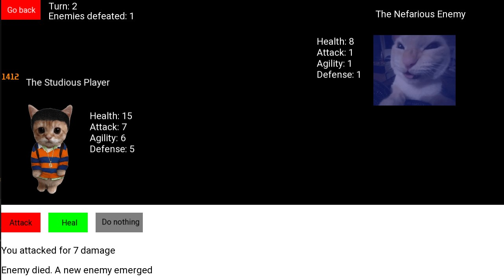

# TurnBasedGame

A 2D turn based game developed in C++. 

   

## Overview

A turn based game where the player has to fight endlessly oncoming enemies. Defeat the most enemies to get the highest score.

Developed in C++ and utilizing SFML.

## Features

### Gameplay

- **Player Abilities:**
	1. Attack
     - Deal damage to the enemy based on your attack and the enemy's defense
	2. Heal
     - Heal yourself based on your agility
	3. Do nothing
- **Enemies:** 
	1. The enemy randomly chooses between attack, heal or do nothing
	2. Enemies' stats scale with each new enemy
	 
### UI

- **Start and game scree**
- **Leaderboard**
	1. The top 5 scores are displayed on the start screen
	2. All scores are stored in a "scores.cmgt" file

## Controls

- **Left-mouse button only:**
